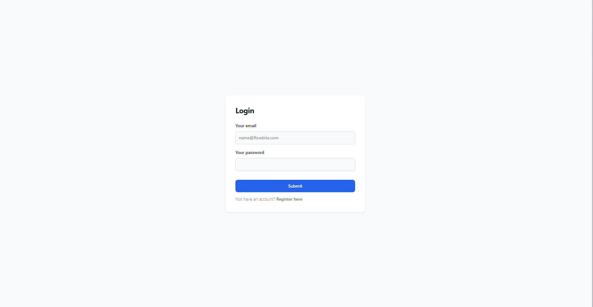

# exercice_spring_todolist
 
## Step 1

### Prerequisite :
- Install [Docker](https://www.docker.com/products/docker-desktop/) 
- Clone this repo
````bash
git clone https://github.com/AlexandreMessuve/exercice_spring_todolist.git
````
## Step 2

### Run this commands:
```bash
docker compose up -d
```

## Step 3
Launch [React app](http://localhost) in your navigator

### Login

2 account is ready:
- admin@admin.fr Adminp@ss1
- user@user.fr Userp@ss1

The Admin account complete crud of todo  
The User only show all todo

[Todo list back image](https://hub.docker.com/r/alexandremessuvem2i/todolist-back)  
[Todo list front image](https://hub.docker.com/r/alexandremessuvem2i/todolist-front)